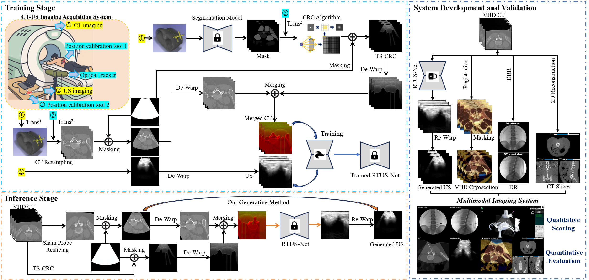
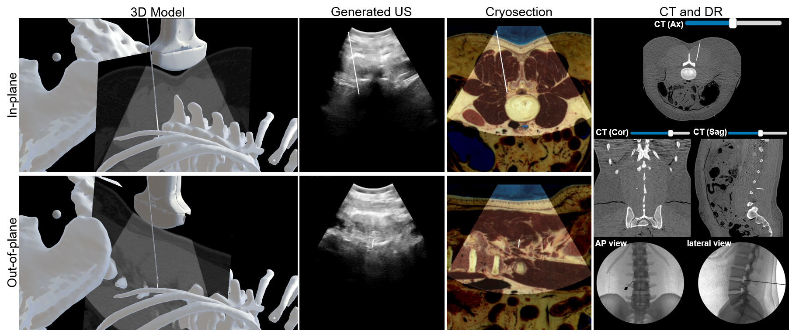
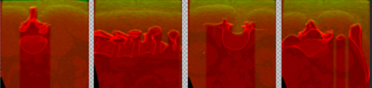

# RTUS-Net
Real-Time CT-to-Ultrasound Simulation for
Image-Guided Musculoskeletal Intervention
Training: Dataset, Generation Method, and
Multimodal Imaging System

The overall workflow of our study:

## Introduction
Here, we propose a CT-centered multimodal
training framework that links X-ray, anatomical, and ultra-
sound through generative modeling, with real-time CT-to-
ultrasound simulation as its core function.

The System Interface:


Our developed ultrasound image simulation-guided minimally invasive procedure training system integrates the proposed RTUS-Net algorithm. It generates high-quality ultrasound images from CT scans (see module indicated by the red circle). It supports real-time, dynamic alignment with other multimodal imaging data, significantly enhancing 3D spatial understanding and surgical accuracy during ultrasound-guided training.

## How to Start Convolutional Simulation Of Ultrasound


The generation of convolutional images requires the following input: ct_mask.nii.gz format mask file that has been segmented by totalsegmentator, and the modification_mask_label function in the ``` cov_img/nii_deal.py ``` file needs to be called for preprocessing.
```bash
python cov_img/get_sim_us.py
```

## Datasets


Unfold and overlay the convolutional images with the CT image, and output a three-channel color image.


## How to Start the Project
Install dependencies:
```bash
pip install -r requirements.txt
```

The project is only compatible with multi-GPU DDP mode for training.
```bash
CUDA_VISIBLE_DEVICES=0,1 torchrun --master_port=12345 --nnodes=1 --nproc_per_node=2 train.py --dataroot ./datasets/cyclegan_datasets--name cyclegan_name --model cycle_gan --use_distributed --batch_size 4  --display_port 8080 --save_epoch_freq 1 --lambda_ssim 0 --lambda_phy 1 --phy_bmode --lambda_lowfreq 1.0  --lambda_ms_ssim 0.5  --lambda_grad 0.3
```

## Dataset
After the article is accepted, we will open-source the high-quality US-CT dataset that we have designed and collected, which will have a positive impact on the community.

## Citation
If you find this repo useful for your research, please consider citing our papers:

```bibtex
@incollection{jiang2025skill,
  title={Skill Transfer Training System for Musculoskeletal Minimally Invasive Treatment Based on Cross-modality Spatial Mapping and Integration},
  author={Jiang, Zekun and Tang, Mengqi and Huang, Fangwen and Ren, Kechen and Liu, Yuhang and Li, Kang and Pu, Dan and Wang, Xiandi},
  booktitle={Proceedings of the SIGGRAPH Asia 2025 Technical Communications},
  pages={1--5},
  year={2025}
}

